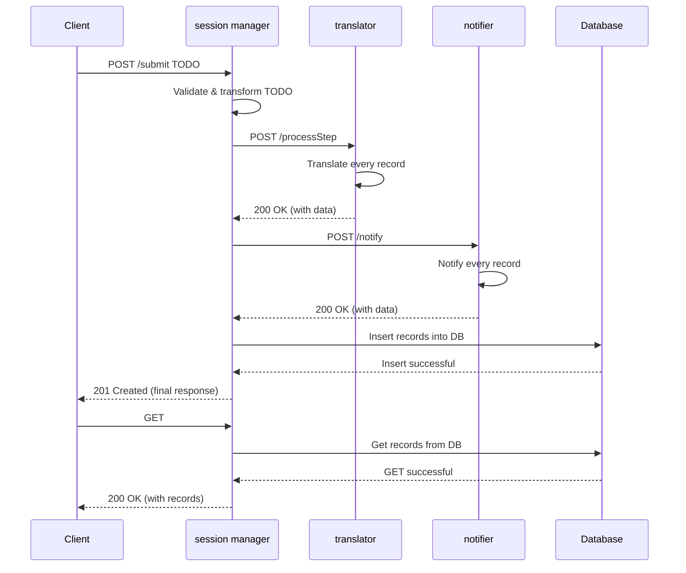

```mermaid
sequenceDiagram
    participant Client
    participant A as session manager
    participant B as translator
    participant C as notifier
    participant DB as Database

    Client->>A: POST /submit TODO
    A->>A: Validate & transform TODO
    A->>B: POST /processStep
    B->>B: Translate every record
    B-->>A: 200 OK (with data)
    A->>C: POST /notify
    C->>C: Notify every record
    C-->>A: 200 OK (with data) 
    A->>DB: Insert records into DB
    DB-->>A: Insert successful
    A-->>Client: 201 Created (final response)

    Client->>A: GET
    A->>DB: Get records from DB
    DB-->>A: GET successful
    A-->>Client: 200 OK (with records)
```
